# ForgeOS

## AI Engineering Optimization Engine

<p align="center">
  
  
  
  
</p>

<p align="center"><strong>Choose the next engineering evaluation with evidence, traceability, and explicit control of uncertainty.</strong></p>

ForgeOS is an engineering optimization and evaluation-orchestration platform for expensive design, calibration, and control problems. It connects problem definitions, candidate generation, authoritative evaluators, constraints, run history, and decision support through a modular architecture.

> **Current scope:** the repository is centered on the Phase 01 Core Engine Foundation. Later capabilities such as Bayesian optimization, surrogate reliability, external simulators, HIL, reinforcement learning, and autonomous campaigns are roadmap stages with explicit acceptance gates. They are not presented here as validated production claims.

<p align="center"><a href="#executive-one-pager">Executive One-Pager</a> · <a href="#architecture-at-a-glance">Architecture</a> · <a href="#quick-start">Quick Start</a> · <a href="docs/diagram-export-pack/README.md">Diagram Pack</a> · <a href="#documentation">Documentation</a></p>

## Executive One-Pager

### The opportunity

Engineering teams spend time and money evaluating designs through simulations, experiments, and physical tests. The hard problem is not only finding a mathematically attractive candidate; it is knowing **which candidate to evaluate next, why it is credible, and what evidence supports the decision**.

### The product

ForgeOS provides a controlled loop:

```text
Problem Definition -> Candidate -> Truth Evaluation -> Result -> Run History -> Next Candidate
```

The optimizer is deliberately independent from the evaluator. A single problem contract can therefore evolve from a deterministic Python benchmark to a versioned command-line simulator or an audited physical experiment without embedding simulator-specific assumptions in the algorithm.

### Stakeholder value

| Stakeholder | What ForgeOS makes clearer |
|---|---|
| Engineering lead | Which target was optimized, under which constraints, and with what evidence |
| Simulation team | A stable adapter contract, failure states, metadata, and artifact expectations |
| Program/product leader | Evaluation cost, progress toward a defined target, and decision traceability |
| Quality or safety reviewer | Reproducibility, explicit infeasibility, validation status, and approval gates |
| Research team | Comparable algorithms, benchmark protocols, uncertainty labels, and preserved trials |

### Investment thesis, without inflated claims

ForgeOS is positioned as an orchestration and evidence layer for expensive engineering optimization. Its differentiation is not “AI replaces engineering judgment.” Its thesis is that better candidate selection, evaluator isolation, controlled experiments, and trustworthy records can reduce wasted evaluations while keeping engineering approval in the loop.

### Maturity snapshot

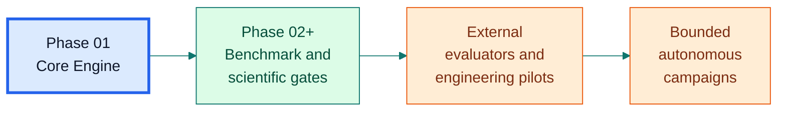

## What ForgeOS Is

ForgeOS is an optimization operating layer for expensive engineering evaluations. It is designed around four commitments:

- **Evaluator independence:** algorithms call an `EvaluationAdapter`, not a simulator implementation.
- **Scientific honesty:** the designated evaluator is the source of truth; surrogate predictions never become truth evaluations by implication.
- **Reproducibility:** runs retain seed, configuration, problem identity, and trial history.
- **Explicit lifecycle state:** failed, timed-out, infeasible, successful, predicted, simulated, validated, and approved states are distinct concepts.

## What ForgeOS Is Not

The master specification deliberately excludes several categories from the initial product boundary. ForgeOS is not initially a CAD system, PLM, CFD/FEA authoring tool, ERP, generic AI assistant, autonomous vehicle controller, or autonomous factory controller. It orchestrates evaluations and optimization; it does not silently replace domain tools or engineering approval.

## Architecture at a Glance

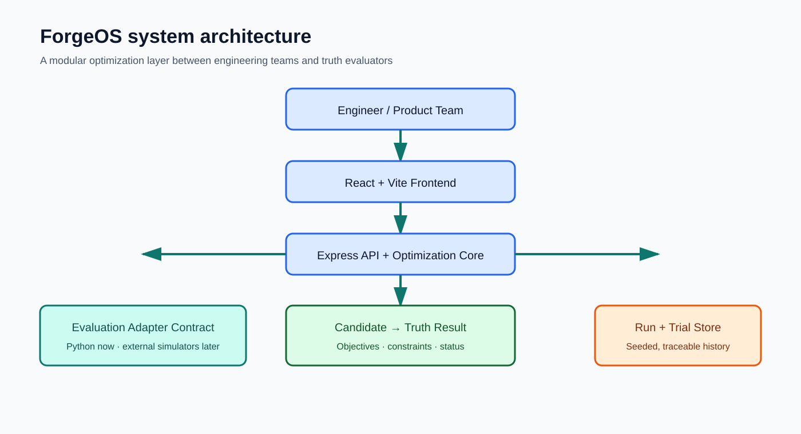

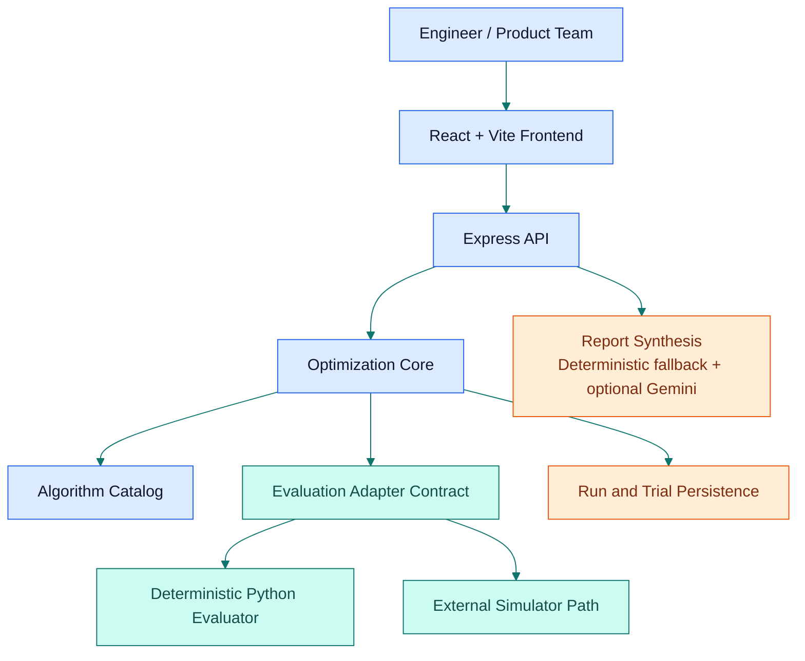

### Architectural choices

| Layer | Current implementation or contract |
|---|---|
| Web experience | React, TypeScript, Vite, Tailwind-compatible styling, Recharts, Lucide icons |
| API/server | Express with Vite middleware in development and static serving in production |
| Core | Problem schemas, candidate validation, evaluation contract, run/trial lifecycle, Random Search, Differential Evolution |
| Evaluator | `PythonFunctionAdapter` with explicit status, objectives, constraints, metadata, and duration |
| Persistence | JSON run repository for the current phase; relational persistence is a later evolution path |
| Optional synthesis | Deterministic server-side report fallback; Gemini synthesis when `GEMINI_API_KEY` is configured |

## Core Engineering Loop

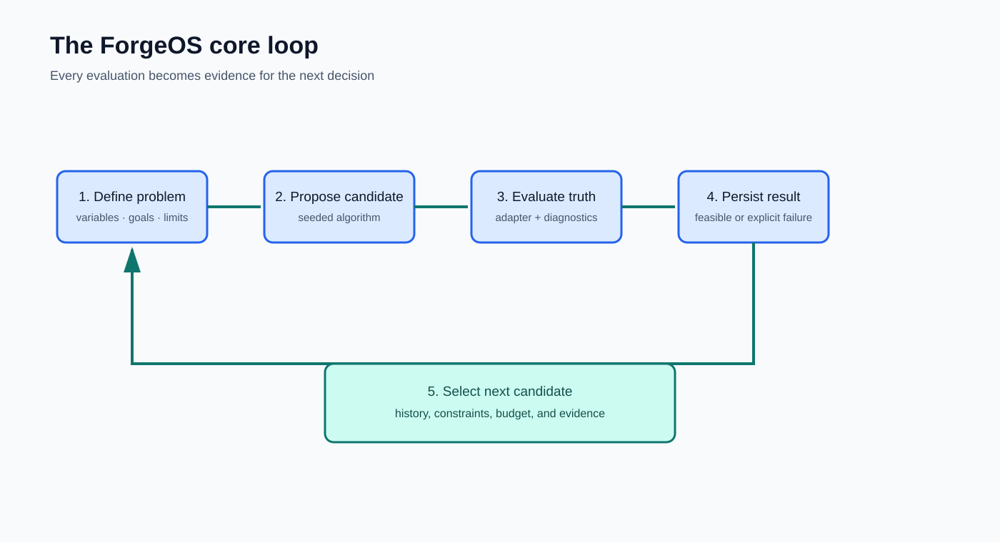

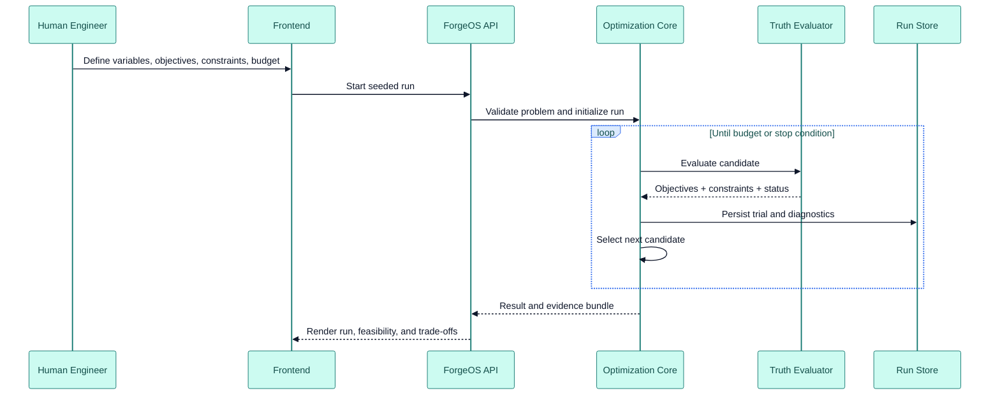

### Phase 01 trial states

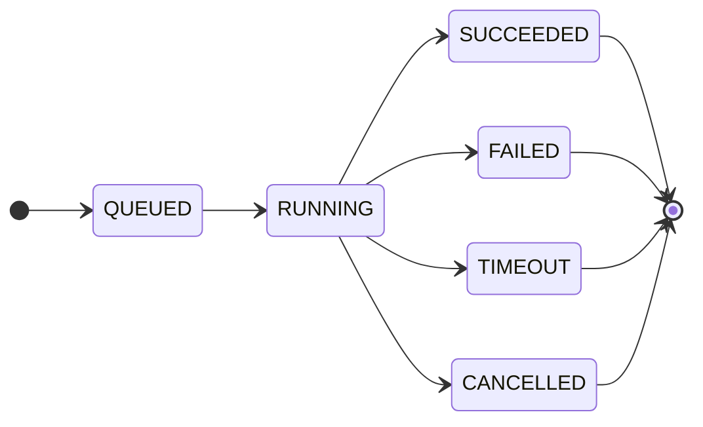

A valid result that violates a constraint is **infeasible**. It is not the same as an evaluator failure. A failed evaluator produced no valid engineering result and must remain visible in the record.

## Core Specifications

### Problem contract

Phase 01 supports continuous variables, integer variables where the selected algorithm supports them, inequality constraints, deterministic Python evaluators, single-objective optimization, persisted runs/trials, and seeded reproducibility.

| Entity | Purpose |
|---|---|
| `Problem` | Versioned namespace containing variables, objectives, constraints, budget, and evaluator identity |
| `Variable` | Continuous, integer, categorical, or discrete parameter with bounds, default, unit, and description |
| `Objective` | Named metric with `minimize` or `maximize` direction and unit |
| `Constraint` | Explicit threshold relation using `<=` or `>=` in Phase 01 |
| `Candidate` | Concrete proposed variable values before evaluation |
| `EvaluationResult` | Objectives, constraints, status, diagnostics, metadata, and duration |
| `Trial` | Immutable-at-the-application-level record of one attempted evaluation |
| `OptimizationRun` | Seed, algorithm configuration, budget, timestamps, status, and trial references |
| `Result` | Best feasible candidate, objective summary, constraint status, and termination reason |

### Evaluation semantics

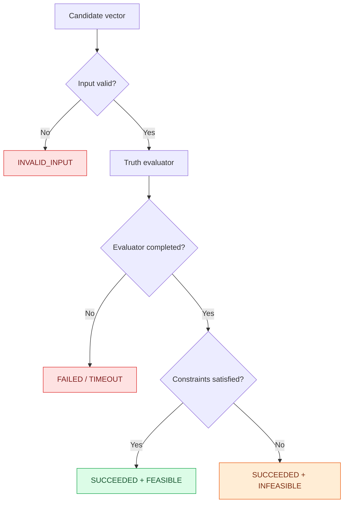

### Budget accounting

Runs should retain attempted evaluations, successful evaluations, failed evaluations, timeouts, wall time, and configured budget. A headline such as “fewer simulations” is not sufficient evidence by itself; comparisons must control for seeds, initialization, fidelity, constraints, parallelism, stopping rules, and equal evaluation cost or a predefined engineering target.

## Algorithms and Scientific Guardrails

### Implemented Phase 01 foundation

- Random Search as an uninformed baseline
- Differential Evolution as an established evolutionary baseline
- Candidate and problem validation
- Seeded run lifecycle and JSON persistence
- Python function evaluation adapter
- Phase 01 API and core tests

### Future stages are gated, not assumed

The implementation packs describe a path for Bayesian optimization, surrogate reliability, truth-guided trust regions, multi-objective decision support, external simulators, robust optimization, HIL, RL, and bounded autonomy. Each stage must prove its own value before the next stage is accepted.

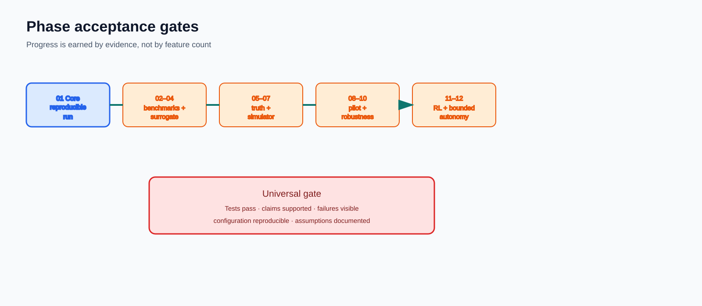

```mermaid
flowchart LR
  P1[01 Core\nReproducible real run] --> P2[02 Benchmark\nControlled comparisons]
  P2 --> P3[03 BO\nExpensive-search benefit]
  P3 --> P4[04 Surrogate\nHoldout and local validation]
  P4 --> P5[05 Truth-guided\nLower truth cost]
  P5 --> P6[06 Multi-objective\nExplicit decision record]
  P6 --> P7[07 Simulator\nReproducible adapter]
  P7 --> P8[08 Pilot\nTrusted baseline and approval]
  P8 --> P9[09 Robust\nUncertainty margins]
  P9 --> P10[10 HIL\nSafe audited experiment]
  P10 --> P11[11 RL\nValidated constrained policy]
  P11 --> P12[12 Autonomous\nBounded audited campaign]
  classDef current fill:#dbeafe,stroke:#2563eb,color:#0f172a,stroke-width:3px;
  classDef gate fill:#ffedd5,stroke:#ea580c,color:#7c2d12;
  class P1 current;
  class P2,P3,P4,P5,P6,P7,P8,P9,P10,P11,P12 gate;
```

### Scientific rules that govern the roadmap

- Never present invented physical relationships as validated engineering knowledge.
- Give engineering variables a unit or explicitly label them dimensionless.
- Distinguish observed, predicted, simulated, experimentally measured, validated, and unvalidated values.
- Validate surrogates on unseen data; training fit is not enough.
- Detect and label extrapolation or out-of-domain use.
- Do not call GP variance total engineering uncertainty without defining the uncertainty sources.
- Periodically call the truth evaluator before trusting surrogate-guided decisions.
- Treat hard constraint violations, numerical failures, stale outputs, and nonphysical results explicitly.
- Apply robustness analysis before hardware deployment.

## Industry Relevance

ForgeOS is relevant where evaluating a candidate is expensive, the design space is constrained, and decisions require evidence.

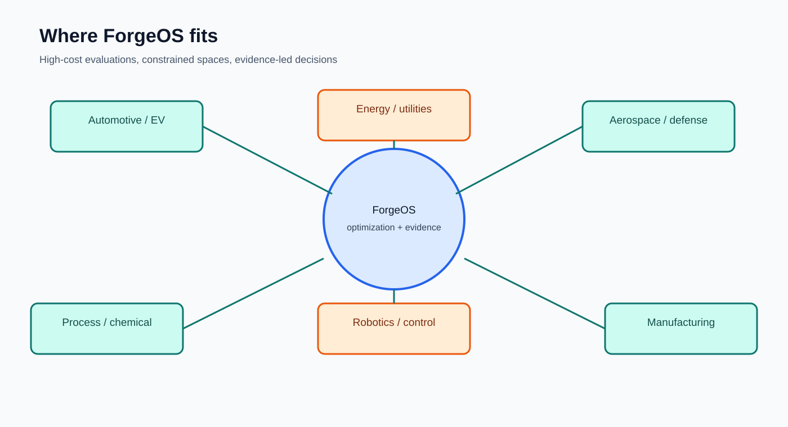

| Industry | Example targets | Example constraints | Relevant ForgeOS capability |
|---|---|---|---|
| Automotive and EV | Thermal efficiency, range, degradation | Battery temperature, safety, cost | Candidate search with explicit feasibility and EV thermal workflows |
| Aerospace and defense | Weight, drag, stability | Stress, thermal envelope, certification evidence | Multi-objective trade-offs and reproducible trial records |
| Energy and utilities | Yield, efficiency, reliability | Grid limits, operating envelope, capex | Controlled comparison and robust scenario evaluation |
| Process and chemical | Throughput, conversion, quality | Pressure, temperature, emissions, safety windows | Calibration and constrained optimization |
| Manufacturing | Cycle time, scrap, cost | Tolerance, tool limits, uptime | Experiment history and process tuning |
| Robotics and control | Tracking error, energy, response | Actuator, latency, dynamics, safety limits | Later adaptive-control and HIL gates |

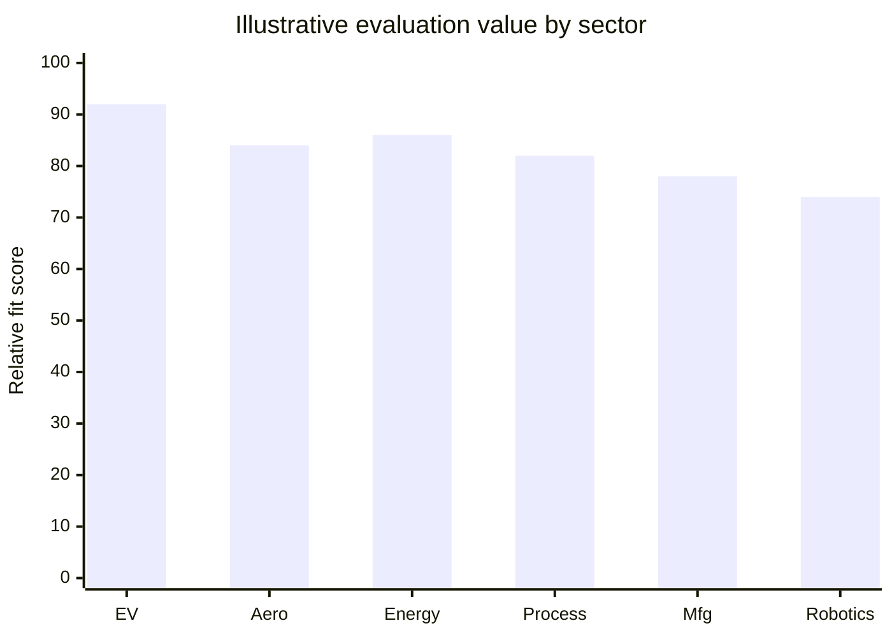

The chart is a communication aid, not a measured market claim. Pilot evidence must be collected against a trusted baseline and a predeclared protocol.

## Repository Structure

```text
apps/api/                         API composition entry
src/components/                   Dashboard, studio, benchmark, surrogate, HITL, RL, autonomous views
src/api/                          Phase 01 API client and integration
src/core/candidate/               Candidate validation
src/core/evaluation/              Evaluation contract and Python adapter
src/core/optimization/            Random Search and Differential Evolution
src/core/persistence/             JSON run repository
src/core/problem/                 Problem schema
src/core/runs/                    Trial and run lifecycle
src/core/tests/                   Core verification tests
scripts/phase01_sphere.py         Reference deterministic evaluator
docs/diagram-export-pack/         Mermaid sources and SVG/PNG presentation exports
server.ts                         Express + Vite server and API routes
```

## API Surface

### Health

`GET /api/health` returns service status and an ISO timestamp.

### Phase 01

The Phase 01 API is mounted at `/api/phase01` and uses a JSON run repository plus an evaluator registry. The included `sphere` evaluator is a deterministic Python benchmark.

The documented Phase 01 resource shape includes:

```text
POST /problems
GET  /problems
GET  /problems/{id}
POST /runs
GET  /runs
GET  /runs/{id}
GET  /runs/{id}/trials
GET  /runs/{id}/result
```

### Autonomous report synthesis

`POST /api/autonomous/synthesize-report` returns deterministic server-side synthesis without a key, or optional Gemini-generated synthesis when `GEMINI_API_KEY` is configured. Generated prose does not turn predicted values into validated engineering evidence.

## Quick Start

### Requirements

- Node.js compatible with the project toolchain
- npm
- Python 3 for the reference Sphere evaluator

### Install and run

```bash
npm install
npm run dev
```

The Express/Vite development server listens on port `3000` by default. Production artifacts can be built and started with:

```bash
npm run build
npm run start
```

Quality checks:

```bash
npm run lint
```

Optional Gemini report synthesis:

```bash
cp .env.example .env
# Set GEMINI_API_KEY in .env only when you want Gemini synthesis.
```

## Typical Usage

1. Open the dashboard and inspect the seeded benchmark problems.
2. Define or select a problem with variables, objectives, constraints, evaluator, and budget.
3. Launch a seeded baseline run from the optimization studio.
4. Inspect every trial, including failures and infeasible results.
5. Compare performance against documented benchmarks and controls.
6. Treat any advanced view as a decision-support surface until its phase gate is met.
7. Record validation evidence, uncertainty, limitations, and approval status for serious engineering use.

## Master Acceptance Gate

No phase is accepted if tests fail, scientific claims are unsupported, evaluator failures are hidden, configuration cannot be reproduced, out-of-scope features were silently added, or the phase depends on an undocumented assumption.

| Phase | Required proof before progression |
|---|---|
| 01 Core | Reproducible real run; failures, constraints, and reproducibility resolved |
| 02 Benchmark | Repeatable, controlled comparisons |
| 03 Bayesian optimization | Demonstrated benefit on expensive-search protocol |
| 04 Surrogate | Credible holdout and local validation |
| 05 Truth-guided | Lower truth-evaluation cost without uncontrolled exploitation |
| 06 Multi-objective | Explicit decision record with no hidden weighting |
| 07 Simulator | Reproducible adapter with stale-output protection |
| 08 Pilot | Trusted baseline, approval, and measured benefit |
| 09 Robust | Acceptable tolerance/environment/aging margins |
| 10 HIL | Safe, bounded, audited experiment |
| 11 RL | Validated constrained policy and safety evidence |
| 12 Autonomous | Bounded, audited campaign that does not bypass controls |

## Diagram Export Pack

The repository includes a presentation-ready visual pack at [`docs/diagram-export-pack`](docs/diagram-export-pack/README.md):

- Mermaid source files in `src/`
- SVG exports in `svg/`
- PNG exports in `png/`
- A restrained ForgeOS palette: navy ink, blue platform layers, teal evaluator paths, green evidence states, amber gates, and coral risk states

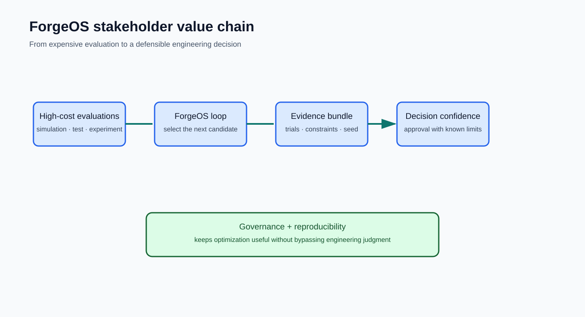

Regenerate the assets with the documented command in the pack README. The source Mermaid files are intentionally kept beside the exports so presentations remain editable rather than becoming detached artwork.

## Documentation

### Product and repository documents

- [`PROJECT_SPEC.md`](PROJECT_SPEC.md) - product and domain specification
- [`ARCHITECTURE.md`](ARCHITECTURE.md) - initial architecture and persistence model
- [`ROADMAP.md`](ROADMAP.md) - repository-level roadmap
- [`DECISIONS.md`](DECISIONS.md) - architectural decisions

### Next-step engineering documentation

- [`forge_next_steps_docs/MASTER_SPEC.md`](forge_next_steps_docs/MASTER_SPEC.md) - authoritative product boundary and terminology
- [`forge_next_steps_docs/PHASE_01_CORE_ENGINE.md`](forge_next_steps_docs/PHASE_01_CORE_ENGINE.md) - current implementation scope and exit gate
- [`forge_next_steps_docs/EVALUATION_CONTRACT.md`](forge_next_steps_docs/EVALUATION_CONTRACT.md) - candidate/result/status semantics
- [`forge_next_steps_docs/SCIENTIFIC_RULES.md`](forge_next_steps_docs/SCIENTIFIC_RULES.md) - scientific and engineering rules
- [`forge_next_steps_docs/ENGINEERING_CRITIQUE.md`](forge_next_steps_docs/ENGINEERING_CRITIQUE.md) - risks and corrected thesis
- [`forge_next_steps_docs/BENCHMARK_AND_VALIDATION_PLAN.md`](forge_next_steps_docs/BENCHMARK_AND_VALIDATION_PLAN.md) - comparison and validation protocol
- [`forge_next_steps_docs/ROADMAP.md`](forge_next_steps_docs/ROADMAP.md) - corrected staged roadmap

### Complete phased implementation pack

- [`forgeos_complete_phased_implementation_pack/00_ORCHESTRATION.md`](forgeos_complete_phased_implementation_pack/00_ORCHESTRATION.md) - implementation orchestration
- [`forgeos_complete_phased_implementation_pack/01_PHASE_01_CORE_ENGINE.md`](forgeos_complete_phased_implementation_pack/01_PHASE_01_CORE_ENGINE.md) through [`12_PHASE_12_AUTONOMOUS_ENGINEERING_LOOP.md`](forgeos_complete_phased_implementation_pack/12_PHASE_12_AUTONOMOUS_ENGINEERING_LOOP.md) - phase scopes, controls, and exit gates
- [`forgeos_complete_phased_implementation_pack/99_MASTER_ACCEPTANCE_MATRIX.md`](forgeos_complete_phased_implementation_pack/99_MASTER_ACCEPTANCE_MATRIX.md) - universal acceptance rules

## License

No license file is currently present. Add a `LICENSE` file before distributing ForgeOS under defined usage rights.
